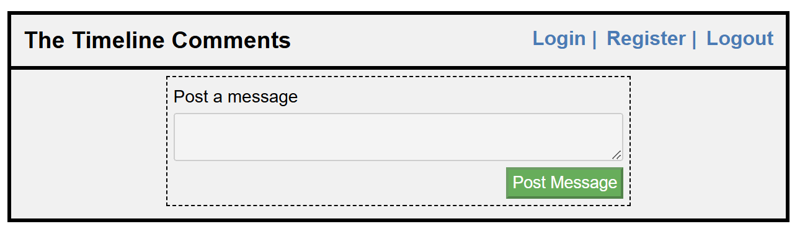
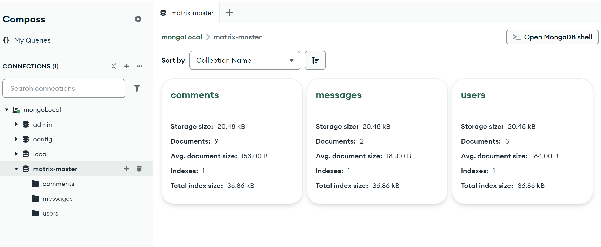

# Assignment The Timeline Comments

## Features

- Backend with Node.js.
- Frontend with Vanilla JS (No EJS).
- MongoDB and Mongoose ORM.
- Full CRUD operations.
- Authentications with JWT

---

### Screenshots

---

<p align="center">
  <table align='center'>
    <tr>
      <td align="center">
        
        <p>Home Page without login</p>
      </td>
      <td align="center">
        
        <p>Login Page</p>
      </td>
    </tr>
    <tr>
      <td align="center">
        
        <p>After Login</p>
      </td>
      <td align="center">
        
        <p>Register Page</p>
      </td>
    </tr>
  </table>
</p>

## How to Run the Project

```bash
# Clone or download the project
git clone <full-repository-url>

# Navigate to the project directory with 'cd' command or file explorer.
 Assignment-TheTimelineComments

# Install dependencies
npm install

# Create .env file in the project main directory and assign  your values  to the variables.
PORT=...
MONGO_URI=...
JWT_SECRET=...

# Start the development server
npm run dev

# Open your browser and go to
http://localhost:PORT
```

## How do you use project?

- Register yourself via Register Form.
- Login the project via Login Form.
- Post your first message.
- Add Comment on the messages.
- Make CRUD operations with related butons.

## ERD (entity-relationship diagram)

<table align='center'>
    <tr>
      <td align="center">
        
      </td>
      <td align="center">
        
      </td>
    </tr>
<table>
<p align='center'>ERD (https://dbdiagram.io/d/time-line-with-mongodb-67e925bf4f7afba184b6017a) && Compas MongoDB </p>

## Relationships with Collections:

### Users <--> Messages:

One user can create many messages (1:N relationship).
Each message belongs to one user.

### Messages <-->Comments:

One message can have many comments (1:N relationship).
Each comment belongs to one message.

### Users <-->Comments:

One user can create many comments (1:N relationship).
Each comment belongs to one user.

## Explanation of Relationships:

### 1. One-to-One (1:1) Relationship:

- Definition: Each entity in one collection is associated with exactly one entity in another collection.
- Example: A User has one Profile, and each Profile belongs to one User.

### 2. One-to-Many (1:N) Relationship:

- Definition: One entity in a collection is associated with multiple entities in another collection.
- Example: A User can create many Messages, but each Message belongs to only one User.

### 3. Many-to-Many (M:N) Relationship:

- Definition: Many entities in one collection are associated with many entities in another collection.
- Example: A User can belong to many Groups, and each Group can have many Users.

## Step-by-Step Explanation of JWT Authentication Process

### 1. User Login
- The user provides their credentials (e.g., email and password) to the login endpoint.
- The backend verifies the credentials by checking the database.
- If the credentials are valid:
  - The server generates a JWT token using a secret key.  (process.env.JWT_SECRET).
  - The token contains a payload with minimal user information (e.g., `userId`, `role`, etc.).
  - The server sends the token back to the client along with any necessary user data.

---

### 2. Client Stores the Token
- The client (frontend) receives the token and stores it securely.
- The token can be stored in:
  - `localStorage`
  - `sessionStorage`
  - A secure cookie (recommended for sensitive applications).

---

### 3. Client Makes Authenticated Requests
- For protected routes, the client includes the token in the `Authorization` header of the request.
- The token is sent as `Bearer <token>` in the header.

---

### 4. Backend Verifies the Token
- The server uses middleware to verify the token.
- The middleware:
  - Extracts the token from the `Authorization` header.
  - Verifies the token using the secret key.
  - If valid, attaches the decoded payload (e.g., `userId`, `role`) to the request object for use in subsequent route handlers.
  - If invalid or expired, returns a `401 Unauthorized` response.

---

### 5. Protected Route Handles the Request
- The protected route uses the data from the verified token to process the request.
- For example:
  - It can use the `userId` or `role` from the token to fetch user-specific data.
  - It can enforce role-based access control.

---

### 6. Token Expiration and Refresh
- Tokens have an expiration time, which is included in the payload (`exp`).
- When the token expires:
  - The user must log in again.
  - Alternatively, a refresh token mechanism can be used.
- If using refresh tokens:
  - A long-lived refresh token is issued during login.
  - The refresh token is used to generate new access tokens when needed.

---
 
## The Protected Routes in this project are as follows:
These routes require authentication (JWT) because they involve sensitive operations or access to private data.

### Messages Routes

- GET /data: Protected with verifyJWT. This route likely fetches sensitive data, so authentication is necessary.
- POST /post: Protected with verifyJWT. Adding a post is a user-specific action, so it must be authenticated.
- DELETE /delete: Protected with verifyJWT. Deleting a post is sensitive and must be restricted to authenticated users.
- PUT /update: Protected with verifyJWT. Updating a post is also a sensitive operation requiring authentication.

### Users Routes

- GET /users: Protected with verifyJWT. Fetching all users is sensitive and should only be accessible to authenticated users.
- DELETE /del-user: Protected with verifyJWT. Deleting a user is a sensitive operation and must be restricted.
- PUT /update-user: Protected with verifyJWT. Updating user information is sensitive and requires authentication.

### Comments Routes

- POST /add-comment: Protected with verifyJWT. Adding a comment is a user-specific action, so it must be authenticated.
- DELETE /del-comment: Protected with verifyJWT. Deleting a comment is sensitive and must be restricted to authenticated users.

## The Unprotected Routes in this project are as follows:
These routes do not require authentication because they are related to public or initial user actions.

### Users Routes
- POST /login: Unprotected. This route is for logging in, so it cannot require a JWT since the user does not have one yet.
- POST /add-user: Unprotected. This route is for user registration (sign-up), so it must be accessible without authentication.


